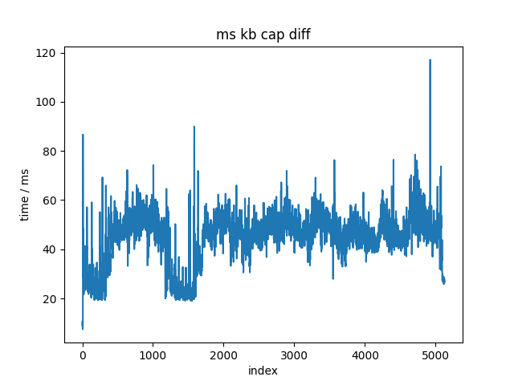

# ~~遥操作计划~~ 人类示范采集计划

~~rdp + 固定鼠标->相对鼠标映射。~~ rdp relative mouse太难用了
~~rdp启动+其他远控软件启动~~，似乎不能截屏，至少parsec不能。先放弃，因为远控软件不可控。
直接截屏+捕获鼠标键盘消息进行录制。不开yap。
（手动F使用其他键映射过去，有interception

pynput无法直接捕获鼠标dx dy，只能捕获绝对位置。相对位置通过差分，在屏幕边缘效果很差。
放弃python进行捕获
cpp的interception可以捕获dx dy 左右键 up down 以及 键盘的 up down~~（需要测试）~~ 测试见apps/ms_kb_test，均可捕获。
捕获频率最高在125Hz左右，可以接受。
TODO: 需要验证

测试interception的dx dy和键盘输入。
对比：autohotkey使用windows的GetAsyncKeyState和GetRawInputData来捕获键盘和鼠标输入。
~~TODO：去除多余的键盘摁下事件。在录制or回放时候实现？录制！~~
~~TODO：对比开环误差。~~ 纯dx dy误差较小，联合误差相当大，-> 说明需要learning based！学， 给我狠狠地学！
猜测误差主要来源于replay？从驱动层replay相当于bottom up？既要经过驱动又要经过OS？

以完成基于interception的键盘鼠标录制。
录制输出为jsonl。
与VPT相同。
录制内容为dx dy scancode + state + 时间戳。

高精度时 in msvc_chron.h 
"using high_resolution_clock = steady_clock;"
NMD 就是别名
三个clock，high_resolution_clock, system_clock, steady_clock
system_clock 单位是100ns，剩下两个一样

基于bitblt进行屏幕录制。
目标：达到50Hz。
录制输出为视频+对应帧的时间戳，考虑同样jsonl格式。
直接保存jpg，1600x900的单帧在311 KB左右，一段60s，50Hz的jpg格式录制结果在0.9GB左右，不能接受。
既然都有损了，还是直接上视频了。
格式与OBS录屏保持一致，.mkv + H.264


经过对比，H264压缩率较好，使用！

输出为三通道+alpha通道视频+对应时间戳。


有没有抽象的必要？
抽象个utils吧，看着难受。


## traning data resample

重新采样到hdf5，抄act的record sim episodes。

使用同样的4:3 x 3?

实际感兴趣的键盘事件（用来确定状态）

W A S D Q E
X space shift T Z
1 2 3 4
鼠标左键 滚轮 dx dy

state dim = 19

目前采集中约10min只出现了一次在0.05s内键盘click的情况，
因此考虑直接不响应click事件，只响应up down事件。
对于鼠标也是仅有一次click事件，因此也不响应click事件，只响应up down事件。

keyboard event: scancode + 0/1. 0 for down, 1 for up
mouse event: state = 0/1/2/4/8/16/32/1024

|state|event|
|---|---|
|0| move, dx, dy|
|1| left down|
|2| left up|
|4| right down|
|8| right up|
|16| middle down|
|32| middle up|
|1024| wheel, rolling, <0 for down, >0 for up, K*120 for rolling|

逆天，recorder写错了，wheel的rolling没有被记录。

是否需要考虑归一化rolling dx dy？
管他呢，先把丹练起来再说。

## 推理相关

0. 需要测试推理频率
1. 需要把实际环境封装成env
2. 在windows上使用gpu推理/量化，if needed

GPU推理，1650上940MB显存，95%使用率。推理频率在25Hz左右。

<details>
<summary>点击展开/折叠</summary>

```
number of parameters: 83.93M
KL Weight 10
loading status: <All keys matched successfully>
policy loaded from ./models/policy_best.ckpt
20 ['rgb', 'alpha']
episode 0
episode 1 reseted
policy cost time: 0.24788498878479004
policy cost time: 0.04613614082336426
policy cost time: 0.04155588150024414
policy cost time: 0.04088902473449707
policy cost time: 0.04034066200256348
policy cost time: 0.04026675224304199
policy cost time: 0.039809465408325195
policy cost time: 0.04023098945617676
policy cost time: 0.04009509086608887
policy cost time: 0.04073286056518555
policy cost time: 0.039798736572265625
policy cost time: 0.03967618942260742
policy cost time: 0.040578365325927734
policy cost time: 0.04021739959716797
policy cost time: 0.04040646553039551
policy cost time: 0.03969383239746094
policy cost time: 0.04032468795776367
policy cost time: 0.03956127166748047
policy cost time: 0.04052019119262695
policy cost time: 0.03984856605529785
policy cost time: 0.041188716888427734
policy cost time: 0.03958463668823242
policy cost time: 0.040534019470214844
policy cost time: 0.03996396064758301
policy cost time: 0.04044675827026367
policy cost time: 0.03999972343444824
policy cost time: 0.040602684020996094
policy cost time: 0.04042482376098633
policy cost time: 0.040052175521850586
policy cost time: 0.04040646553039551
policy cost time: 0.040402889251708984
policy cost time: 0.04096198081970215
policy cost time: 0.039794206619262695
policy cost time: 0.04044842720031738
policy cost time: 0.040230512619018555
policy cost time: 0.04017281532287598
policy cost time: 0.04046940803527832
policy cost time: 0.04038238525390625
policy cost time: 0.039876699447631836
policy cost time: 0.040224313735961914
policy cost time: 0.040181875228881836
policy cost time: 0.04074835777282715
policy cost time: 0.04024052619934082
policy cost time: 0.04047036170959473
policy cost time: 0.04026675224304199
policy cost time: 0.03995394706726074
policy cost time: 0.04031181335449219
policy cost time: 0.04022693634033203
policy cost time: 0.04422402381896973
policy cost time: 0.040262699127197266
policy cost time: 0.039905548095703125
policy cost time: 0.04033374786376953
policy cost time: 0.04022049903869629
policy cost time: 0.03992772102355957
policy cost time: 0.04020237922668457
policy cost time: 0.04030132293701172
policy cost time: 0.04083824157714844
policy cost time: 0.04009079933166504
policy cost time: 0.04003787040710449
policy cost time: 0.040384531021118164
policy cost time: 0.04086637496948242
policy cost time: 0.04016566276550293
policy cost time: 0.04055523872375488
policy cost time: 0.041004180908203125
policy cost time: 0.04082608222961426
policy cost time: 0.04035639762878418
policy cost time: 0.03992414474487305
policy cost time: 0.04020214080810547
policy cost time: 0.04000711441040039
policy cost time: 0.04039335250854492
policy cost time: 0.04012131690979004
policy cost time: 0.040618896484375
policy cost time: 0.04160451889038086
policy cost time: 0.04009294509887695
policy cost time: 0.040244340896606445
policy cost time: 0.039781808853149414
policy cost time: 0.040757179260253906
policy cost time: 0.03998994827270508
policy cost time: 0.04109501838684082
policy cost time: 0.04034900665283203
policy cost time: 0.04010343551635742
policy cost time: 0.040680646896362305
policy cost time: 0.04023265838623047
policy cost time: 0.04090237617492676
policy cost time: 0.03957343101501465
policy cost time: 0.04010725021362305
policy cost time: 0.04057598114013672
policy cost time: 0.04024958610534668
policy cost time: 0.040456295013427734
policy cost time: 0.040045976638793945
policy cost time: 0.04030632972717285
policy cost time: 0.04042196273803711
policy cost time: 0.040312767028808594
policy cost time: 0.04008913040161133
policy cost time: 0.04027962684631348
policy cost time: 0.04114079475402832
policy cost time: 0.04072093963623047
policy cost time: 0.040074825286865234
policy cost time: 0.040160179138183594
policy cost time: 0.04040169715881348
policy cost time: 0.0417788028717041
policy cost time: 0.040772199630737305
policy cost time: 0.04053950309753418
policy cost time: 0.04054713249206543
policy cost time: 0.03999781608581543
policy cost time: 0.04011797904968262
policy cost time: 0.04048013687133789
policy cost time: 0.040229082107543945
policy cost time: 0.04073381423950195
policy cost time: 0.04063296318054199
policy cost time: 0.042700767517089844
policy cost time: 0.04044532775878906
policy cost time: 0.040183067321777344
policy cost time: 0.04022860527038574
policy cost time: 0.03993415832519531
policy cost time: 0.04033613204956055
policy cost time: 0.04172468185424805
policy cost time: 0.04092526435852051
policy cost time: 0.04076576232910156
policy cost time: 0.039971351623535156
policy cost time: 0.0408167839050293
policy cost time: 0.03987574577331543
policy cost time: 0.040430545806884766
policy cost time: 0.040289878845214844
policy cost time: 0.04064607620239258
policy cost time: 0.039885520935058594
policy cost time: 0.04063844680786133
policy cost time: 0.03989887237548828
policy cost time: 0.04066610336303711
policy cost time: 0.0432283878326416
policy cost time: 0.04082608222961426
policy cost time: 0.042026519775390625
policy cost time: 0.03962111473083496
policy cost time: 0.04136919975280762
policy cost time: 0.039786338806152344
policy cost time: 0.040505409240722656
policy cost time: 0.040525197982788086
policy cost time: 0.0433354377746582
policy cost time: 0.04018402099609375
policy cost time: 0.04085493087768555
policy cost time: 0.04040360450744629
policy cost time: 0.040296316146850586
policy cost time: 0.04077601432800293
policy cost time: 0.04036855697631836
policy cost time: 0.04076385498046875
policy cost time: 0.040678977966308594
policy cost time: 0.04172801971435547
policy cost time: 0.040747880935668945
policy cost time: 0.040535688400268555
policy cost time: 0.04029202461242676
policy cost time: 0.04046177864074707
policy cost time: 0.04064583778381348
policy cost time: 0.04082942008972168
policy cost time: 0.040602922439575195
policy cost time: 0.04002261161804199
policy cost time: 0.04046988487243652
policy cost time: 0.03979778289794922
policy cost time: 0.040772438049316406
policy cost time: 0.04049825668334961
policy cost time: 0.04044985771179199
policy cost time: 0.04039812088012695
policy cost time: 0.040955543518066406
policy cost time: 0.04027080535888672
policy cost time: 0.04065442085266113
policy cost time: 0.04112839698791504
policy cost time: 0.043868064880371094
policy cost time: 0.04077792167663574
policy cost time: 0.04028034210205078
policy cost time: 0.04063105583190918
policy cost time: 0.04011201858520508
policy cost time: 0.0405123233795166
policy cost time: 0.04060220718383789
policy cost time: 0.04271507263183594
policy cost time: 0.0404667854309082
policy cost time: 0.040477752685546875
policy cost time: 0.04366254806518555
policy cost time: 0.04015088081359863
policy cost time: 0.040462493896484375
policy cost time: 0.03997039794921875
policy cost time: 0.04118680953979492
policy cost time: 0.040691375732421875
policy cost time: 0.040297746658325195
policy cost time: 0.04057478904724121
policy cost time: 0.04029583930969238
policy cost time: 0.0407259464263916
policy cost time: 0.03971433639526367
policy cost time: 0.04060053825378418
policy cost time: 0.03979802131652832
policy cost time: 0.04070758819580078
policy cost time: 0.040131568908691406
policy cost time: 0.04072999954223633
policy cost time: 0.0427708625793457
policy cost time: 0.04099106788635254
policy cost time: 0.040162086486816406
policy cost time: 0.04214644432067871
policy cost time: 0.04184842109680176
policy cost time: 0.040117740631103516
policy cost time: 0.04062080383300781
policy cost time: 0.04264187812805176
policy cost time: 0.040508270263671875
policy cost time: 0.04002499580383301
```

</details>

TODO: 测试onnx


## SOME RESULTS in intercption test

重放用时而言，重放完毕用时大概是录制用时的两倍。
在将事件之间记录的延时减半之后，依旧在录制用时的两倍左右，说明事件之间手动的sleep并不是关键路径，
而可能是interception库的发送事件的效率问题。
TODO：对比OS的事件发送效率。which is the same with AutoHotKey.
优先级不高，问题不在重放上面。有反馈保底（？）

此外，对于鼠标，一次移动x，和分n次移动-x//n，偏差很大。
SOLUTION：将Windows的鼠标设置中的“提高指针精确度”关闭，可以显著降低偏差。


截屏采集结果频率在20Hz左右，可以接受。
直接降频推理得了，反正VPT也是20Hz。
键鼠采集结果频率在80Hz左右，可以接受。




## RESULTS in act training


## 环境依赖

cpp的

interception -> 自动安装

nlohmann/json -> 自动安装

OpenCV -> 手动安装

H.264需要**手动下载**codec，这个与opencv版本相关。

python的

目前与act一致。见[act install](https://github.com/tonyzhaozh/act?tab=readme-ov-file#installation)。


## 一些大声BB

~~在遥端跑genshin和yap，以实现自动拾取和自动tp。~~
~~遥端TODO：自动化的tp？~~

~~主端进行截屏和post 键盘鼠标message到rdp窗口。~~

通过录制进行演示，rdp帧率实在是不行。
截屏和键鼠捕获频率均能达到50Hz，可以接受。

实测截屏只能到20Hz。


# ALOHA & Mobile ALOHA read note

## 采集频率

30Hz，遥操作。

# VPT read note
## 采集频率


VPT：20Hz 采集和

## 动作空间 


gym里面：discrete and continuous。

binary action：各种按键
连续：鼠标移动，离散到角度的bins


# 观测空间

VPT 是 渲染640x360原始像素，炒鸡离谱的16 : 9。输入到模型时候，resize -> 128x128，同时渲染一个鼠标指针以模拟人类操作。


压缩后遥操作试试。

# 删除空操作

