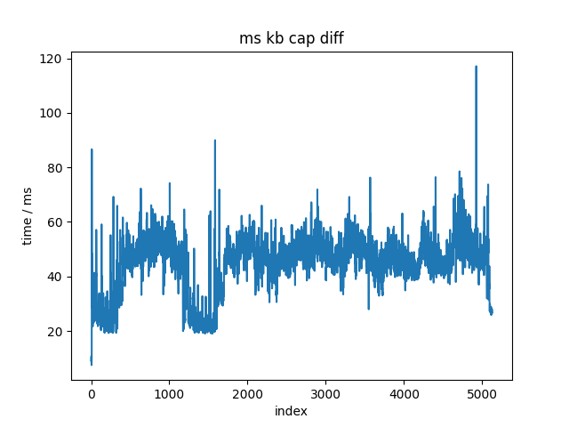
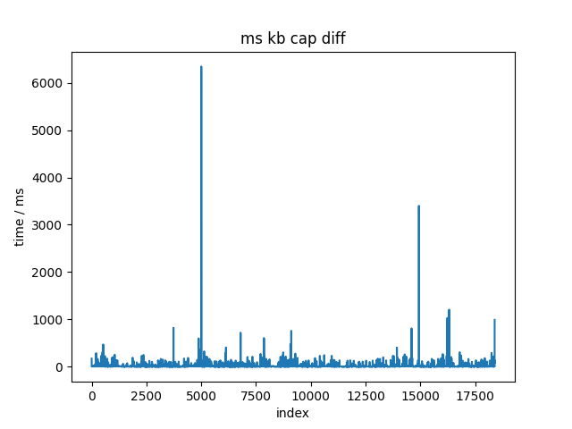

# ~~遥操作计划~~ 人类示范采集计划

~~rdp + 固定鼠标->相对鼠标映射。~~ rdp relative mouse太难用了
~~rdp启动+其他远控软件启动~~，似乎不能截屏，至少parsec不能。先放弃，因为远控软件不可控。
直接截屏+捕获鼠标键盘消息进行录制。不开yap。
（手动F使用其他键映射过去，有interception

pynput无法直接捕获鼠标dx dy，只能捕获绝对位置。相对位置通过差分，在屏幕边缘效果很差。
放弃python进行捕获
cpp的interception可以捕获dx dy 左右键 up down 以及 键盘的 up down~~（需要测试）~~ 测试见apps/ms_kb_test，均可捕获。
捕获频率最高在125Hz左右，可以接受。
TODO: 需要验证

测试interception的dx dy和键盘输入。
对比：autohotkey使用windows的GetAsyncKeyState和GetRawInputData来捕获键盘和鼠标输入。
~~TODO：去除多余的键盘摁下事件。在录制or回放时候实现？录制！~~
~~TODO：对比开环误差。~~ 纯dx dy误差较小，联合误差相当大，-> 说明需要learning based！学， 给我狠狠地学！
猜测误差主要来源于replay？从驱动层replay相当于bottom up？既要经过驱动又要经过OS？

以完成基于interception的键盘鼠标录制。
录制输出为jsonl。
与VPT相同。
录制内容为dx dy scancode + state + 时间戳。

高精度时 in msvc_chron.h 
"using high_resolution_clock = steady_clock;"
NMD 就是别名
三个clock，high_resolution_clock, system_clock, steady_clock
system_clock 单位是100ns，剩下两个一样

基于bitblt进行屏幕录制。
目标：达到50Hz。
录制输出为视频+对应帧的时间戳，考虑同样jsonl格式。
直接保存jpg，1600x900的单帧在311 KB左右，一段60s，50Hz的jpg格式录制结果在0.9GB左右，不能接受。
既然都有损了，还是直接上视频了。
格式与OBS录屏保持一致，.mkv + H.264

经过对比，H264压缩率较好，使用！

输出为三通道+alpha通道视频+对应时间戳。

有没有抽象的必要？
抽象个utils吧，看着难受。

重新采样到hdf5，抄act的record sim episodes。

## SOME RESULTS in intercption test

重放用时而言，重放完毕用时大概是录制用时的两倍。
在将事件之间记录的延时减半之后，依旧在录制用时的两倍左右，说明事件之间手动的sleep并不是关键路径，
而可能是interception库的发送事件的效率问题。
TODO：对比OS的事件发送效率。which is the same with AutoHotKey.
优先级不高，问题不在重放上面。有反馈保底（？）

此外，对于鼠标，一次移动x，和分n次移动-x//n，偏差很大。
SOLUTION：将Windows的鼠标设置中的“提高指针精确度”关闭，可以显著降低偏差。

截屏采集结果频率在20Hz左右，可以接受。
直接降频推理得了，反正VPT也是20Hz。
键鼠采集结果频率在80Hz左右，可以接受。

## 环境依赖

cpp的

interception -> 自动安装

nlohmann/json -> 自动安装

OpenCV -> 手动安装

H.264需要**手动下载**codec，这个与opencv版本相关。

python的

目前与act一致。见[act install](https://github.com/tonyzhaozh/act?tab=readme-ov-file#installation)。

## 一些大声BB

~~在遥端跑genshin和yap，以实现自动拾取和自动tp。~~
~~遥端TODO：自动化的tp？~~

~~主端进行截屏和post 键盘鼠标message到rdp窗口。~~

通过录制进行演示，rdp帧率实在是不行。
截屏和键鼠捕获频率均能达到50Hz，可以接受。

实测截屏只能到20Hz。

# ALOHA & Mobile ALOHA read note

## 采集频率

30Hz，遥操作。

# VPT read note
## 采集频率

VPT：20Hz 采集和

## 动作空间 

gym里面：discrete and continuous。

binary action：各种按键
连续：鼠标移动，离散到角度的bins

# 观测空间

VPT 是 渲染640x360原始像素，炒鸡离谱的16 : 9。输入到模型时候，resize -> 128x128，同时渲染一个鼠标指针以模拟人类操作。

压缩后遥操作试试。

# 删除空操作

